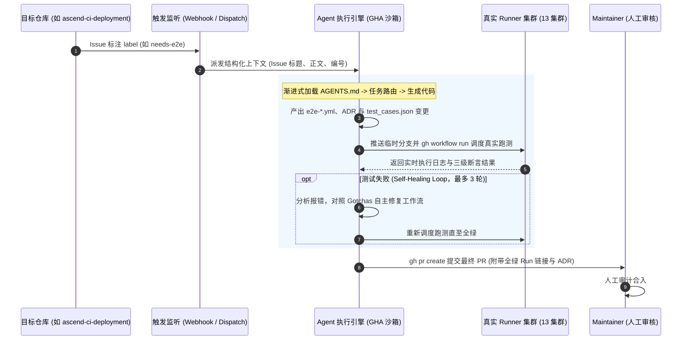

# 0003 — 基于 Agentic Workflow 实现 Issue 驱动的 E2E 用例自闭环开发与验证

- 状态：已接受 (2026-09-28)
- 决策人：CI / 基础设施测试组
- 关联：PR [#23](https://github.com/ascend-gha-runners/test/pull/23), [`AGENTS.md`](../../AGENTS.md), [`docs/test-cases.md`](../test-cases.md)

## 背景

当前基础设施仓库（如 [ascend-ci-deployment](https://github.com/opensourceways/ascend-ci-deployment)）持续演进，频繁提出各类测试验证诉求（如新开放 Nginx 代理端口、增加 upstream 回退链、调整 Runner 调度标签等）。

目前新用例的开发模式存在明显痛点：
1. **编写成本高且重复性大**：每次上游提出特性需求，测试人员都需要手动查阅规格、依照双重视角规范编写 Workflow、并在多集群反复调度排查语法或环境问题；
2. **人工排错耗时**：测试脚本在真实集群执行时常遭遇 IDC 网络代理、CANN 基础镜像命令缺失（如 `hostname`）、SFS 目录并发踩踏等共性陷阱，需要反复试错修改。

在本仓库通过 [`AGENTS.md`](../../AGENTS.md) 建立了严格的**仓库架构地图、任务路由、三级断言标准与避坑基线 (Gotchas)**，且拥有完整的机读元数据（[`runners.json`](../../.github/config/runners.json) 与 [`test_cases.json`](../../.github/config/test_cases.json)）后，本仓库已具备支撑 **Agentic Workflow（智能体自主研发流水线）** 的完备基础。

## 决策架构：目标形态 (Target Architecture)

决定在本仓库引入 **基于 Agentic Workflow 的 Issue 驱动 E2E 自闭环研发机制**。系统由四阶段自闭环链路构成：

### 1. 阶段一：跨仓事件监听与上下文派发 (Trigger & Dispatch)
- **触发源**：监听目标仓库（`ascend-ci-deployment`）带有特定 Label（如 `needs-e2e`）的 Issue 变更；
- **事件转发**：通过 GitHub Actions / Webhook 发送 `repository_dispatch` 到本仓库，注入包含 Issue 编号、标题、需求描述、目标集群及提交者的结构化 Payload；
- **防护机制**：严格校验触发源身份，防止非信任用户的 Prompt Injection。

### 2. 阶段二：Agent 上下文加载与用例生成 (Autonomous Reasoning)
- **沙箱运行**：在受限的 GHA Runner 容器内启动 Agent 引擎；
- **渐进式加载**：
  1. Agent 读取根目录 [`AGENTS.md`](../../AGENTS.md) 路由到“场景 B：平台特性开发”；
  2. 自动检索 [`runners.json`](../../.github/config/runners.json) 确定目标集群标签与架构要求（若涉及 PyTorch 则自动注入 amd64 跳过逻辑，遵循 ADR-0002）；
  3. 审查需求是否涉及方案/选型变化；如涉及，Agent 必须先在 [`docs/adr/`](./) 撰写新的 ADR 文档；
  4. 生成符合规范的 `e2e-feature-<能力>.yml` 工作流，显式组织 `【基础功能】` 与 `【用户视角场景】` 两大步骤（遵循 ADR-0001）；
  5. 同步在 `test_cases.json` 登记硬断言、软断言与探针清单。

### 3. 阶段三：真实集群调度与自愈验证闭环 (Test-in-the-Loop & Self-Healing)
**这是该体系的核心——用例必须在真实集群通过检验，而非仅停留在代码生成：**
- **调度执行**：Agent 将新用例推送到临时分支 `agent/issue-<ID>`，调用 `gh workflow run` 调度真实集群跑测；
- **自愈循环 (Self-Healing Loop)**：
  - 轮询等待 Job 执行完毕，分析 Exit Code 与断言响应头；
  - 若执行失败，Agent 抓取 Step 日志，对照 `AGENTS.md` 的 Gotchas 常见陷阱（如补齐 `gh-proxy` 代理、修复 `hostname`、增加 403 降级处理等）自动修正 Workflow 代码；
  - 自动重新推送分支并再次 dispatch 验证；
  - **熔断控制**：设置单次任务上限 `max_healing_turns = 3` 与 `timeout-minutes = 60`，防止因硬件物理离线导致死循环。

### 4. 阶段四：人机协同交付 (Human-in-the-Loop Delivery)
- **自动提 PR**：用例在真实集群全绿通过后，Agent 自动调用 `gh pr create`；
- **交付内容包括**：
  1. 关联上游 Issue 的结构化 PR 描述；
  2. 真实集群跑通的 Workflow Run URL 证据；
  3. 附带的 `docs/adr/` 架构决策记录；
  4. 变更的 `test_cases.json` 元数据；
- **合入底线**：Agent **仅具备 PR 创建权限，严禁自动合入 main 分支**，最终合并权始终保留在 Maintainer 手中。

## 理由与收益

1. **大幅提升 E2E 交付效率**：将繁琐的“看 Issue -> 查 Runner 标签 -> 写 YAML -> 部署排查 -> 调格式 -> 提 PR”全程自动化，开发耗时从数小时压缩至分钟级；
2. **规范执行 100% 达标**：机器 Agent 严格遵循 `AGENTS.md` 与 ADR 约定，杜绝漏写断言分级、遗漏 `gh-proxy` 代理或写出无真实用户场景的浅层探针；
3. **闭环防伪**：与纯代码生成式工具不同，本机制以“真实集群跑绿”为交付硬指标，提交即代表已通过硬件环境验收。

## 实施阶段演进 (Rollout Roadmap)

- **Phase 1（本次）**：完成 ADR 蓝图架构决策与规范固化（不包含具体实现逻辑）；
- **Phase 2（原型验证）**：构建 `.github/workflows/agentic-e2e-builder.yml`，先支持 `workflow_dispatch` 手工输入 Issue URL 或需求文本，打通“生成 -> 调度 -> 自愈 -> 提 PR”闭环；
- **Phase 3（跨仓联通）**：配置 GitHub App 与跨仓库 `repository_dispatch`，打通 `ascend-ci-deployment` 到本仓库的无人值守全自动触发。
