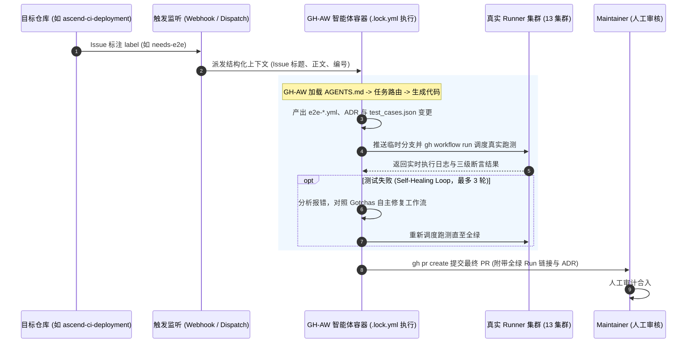

# 0003 — 基于 Agentic Workflow 实现 Issue 驱动的 E2E 用例自闭环开发与验证

- 状态：已接受 (2026-09-28)
- 决策人：CI / 基础设施测试组
- 关联：PR [#23](https://github.com/ascend-gha-runners/test/pull/23), [`AGENTS.md`](../../AGENTS.md), [`docs/test-cases.md`](../test-cases.md), [`docs/adr/0004-基于agentic-workflow实现e2e测试异常智能巡检与跨仓issue闭环跟踪.md`](0004-基于agentic-workflow实现e2e测试异常智能巡检与跨仓issue闭环跟踪.md)

## 背景

当前基础设施仓库（如 [ascend-ci-deployment](https://github.com/opensourceways/ascend-ci-deployment)）持续演进，频繁提出各类测试验证诉求（如新开放 Nginx 代理端口、增加 upstream 回退链、调整 Runner 调度标签等）。

目前新用例的开发模式存在明显痛点：
1. **编写成本高且重复性大**：每次上游提出特性需求，测试人员都需要手动查阅规格、依照双重视角规范编写 Workflow、并在多集群反复调度排查语法或环境问题；
2. **人工排错耗时**：测试脚本在真实集群执行时常遭遇 IDC 网络代理、CANN 基础镜像命令缺失（如 `hostname`）、SFS 目录并发踩踏等共性陷阱，需要反复试错修改。

在本仓库通过 [`AGENTS.md`](../../AGENTS.md) 建立了严格的**仓库架构地图、任务路由、三级断言标准与避坑基线 (Gotchas)**，且拥有完整的机读元数据（[`runners.json`](../../.github/config/runners.json) 与 [`test_cases.json`](../../.github/config/test_cases.json)）后，本仓库已具备支撑 **Agentic Workflow（智能体自主研发流水线）** 的完备基础。

---

## 技术方案选型：GitHub Agentic Workflows (GH-AW)

为了避免传统方式中手写脆弱且难以审计的黑盒 Python 脚本包装器，本机制**全面采用 GitHub 官方开源的 Agentic Workflow 体系——GitHub Agentic Workflows (GH-AW, `github/gh-aw`) 作为统一底层架构标准**：

1. **以 Markdown 为核心的工作流定义 (`.github/workflows/*.md`)**：
   - **YAML Frontmatter**：声明式配置触发事件（`repository_dispatch` / `workflow_dispatch`）、底层 AI 引擎（如 Claude 3.5 Sonnet / Gemini Pro）、沙箱权限与挂载工具集（`tools: [github, bash]`）；
   - **Markdown Prompt Body**：使用自然语言与规范化 Prompt 编排 Agent 研发任务，天然契合本仓库已建立的 `AGENTS.md` 规则与断言分级基线；
2. **安全、确定性的编译执行 (`gh aw compile -> .lock.yml`)**：
   - 利用 `gh aw` 编译器将 `.md` 声明编译锁定为确定性的 `.lock.yml` GitHub Actions 执行文件；
   - 保证提示词与工作流执行逻辑的版本化追踪（Git-tracked）、强审查性与防漂移；
3. **原生受限权限与安全边界**：
   - 依赖 GHA 原生 OIDC 凭据与细粒度权限控制，严格限制写权限仅限于指定的分支创建与 PR 提交，严禁直接推送默认分支。

---

## 决策架构：目标形态 (Target Architecture)

系统基于 GH-AW 架构构建四阶段自闭环开发验证链路：



### 1. 阶段一：跨仓事件监听与上下文派发 (Trigger & Dispatch)
- **触发源**：监听目标仓库（`ascend-ci-deployment`）带有特定 Label（如 `needs-e2e`）的 Issue 变更；
- **事件转发**：通过 GitHub Actions / Webhook 发送 `repository_dispatch` 到本仓库，注入包含 Issue 编号、标题、需求描述、目标集群及提交者的结构化 Payload；
- **防护机制**：严格校验触发源身份，防止非信任用户的 Prompt Injection。

### 2. 阶段二：GH-AW 规范加载与用例生成 (Autonomous Reasoning via GH-AW)
- **GH-AW 规范文件**：定义为 `.github/workflows/agentic-e2e-builder.md`；
- **Frontmatter 声明**：
  ```yaml
  name: Agentic E2E Builder
  on:
    repository_dispatch:
      types: [trigger-e2e-dev]
    workflow_dispatch:
      inputs:
        issue_url: { description: "需求 Issue URL", required: true }
  engine: claude-3-5-sonnet
  permissions:
    contents: write
    pull-requests: write
    actions: write
  tools:
    - github
    - bash
  ```
- **渐进式加载**：
  1. Agent 读取根目录 [`AGENTS.md`](../../AGENTS.md) 路由到“场景 B：平台特性开发”；
  2. 自动检索 [`runners.json`](../../.github/config/runners.json) 确定目标集群标签与架构要求（若涉及 PyTorch 则自动注入 amd64 跳过逻辑，遵循 ADR-0002）；
  3. 审查需求是否涉及方案/选型变化；如涉及，Agent 必须先在 [`docs/adr/`](./) 撰写新的 ADR 文档；
  4. 生成符合规范的 `e2e-feature-<能力>.yml` 工作流，显式组织 `【基础功能】` 与 `【用户视角场景】` 两大步骤（遵循 ADR-0001）；
  5. 同步在 `test_cases.json` 登记硬断言、软断言与探针清单。

### 3. 阶段三：真实集群调度与自愈验证闭环 (Test-in-the-Loop & Self-Healing)
**这是该体系的核心——用例必须在真实集群通过检验，而非仅停留在代码生成：**
- **调度执行**：Agent 将新用例推送到临时分支 `agent/issue-<ID>`，调用 `gh workflow run` 调度真实集群跑测；
- **自愈循环 (Self-Healing Loop)**：
  - 轮询等待 Job 执行完毕，分析 Exit Code 与断言响应头；
  - 若执行失败，Agent 抓取 Step 日志，对照 `AGENTS.md` 的 Gotchas 常见陷阱（如补齐 `gh-proxy` 代理、修复 `hostname`、增加 403 降级处理等）自动修正 Workflow 代码；
  - 自动重新推送分支并再次 dispatch 验证；
  - **熔断控制**：设置单次任务上限 `max_healing_turns = 3` 与 `timeout-minutes = 60`，防止因硬件物理离线导致死循环。

### 4. 阶段四：人机协同交付 (Human-in-the-Loop Delivery)
- **自动提 PR**：用例在真实集群全绿通过后，Agent 自动调用 `gh pr create`；
- **交付内容包括**：
  1. 关联上游 Issue 的结构化 PR 描述；
  2. 真实集群跑通的 Workflow Run URL 证据；
  3. 附带的 `docs/adr/` 架构决策记录；
  4. 变更的 `test_cases.json` 元数据；
- **合入底线**：Agent **仅具备 PR 创建权限，严禁自动合入 main 分支**，最终合并权始终保留在 Maintainer 手中。

---

## 理由与收益

1. **统一技术栈与降本增效**：通过引入 GH-AW 标准，免去了繁琐的自研 agent 调度平台建设，提示词以 Markdown 版本化管理；
2. **规范执行 100% 达标**：机器 Agent 严格遵循 `AGENTS.md` 与 ADR 约定，杜绝漏写断言分级、遗漏 `gh-proxy` 代理或写出无真实用户场景的浅层探针；
3. **闭环防伪**：与纯代码生成式工具不同，本机制以“真实集群跑绿”为交付硬指标，提交即代表已通过硬件环境验收；
4. **与 ADR-0004 协同飞轮**：正向由 GH-AW 构建用例，反向由 GH-AW 巡检告警，形成完整的生命周期闭环。

---

## 实施阶段演进 (Rollout Roadmap)

- **Phase 1（本次）**：完成 ADR 蓝图架构决策，锁定 GitHub Agentic Workflows (GH-AW) 选型标准；
- **Phase 2（原型验证）**：编写 `.github/workflows/agentic-e2e-builder.md`，使用 `gh aw compile` 编译为 `.lock.yml`，打通单用例从输入到提 PR 的自动化闭环；
- **Phase 3（跨仓联通）**：配置 GitHub App 与跨仓库 `repository_dispatch`，打通 `ascend-ci-deployment` 到本仓库的无人值守全自动触发。
