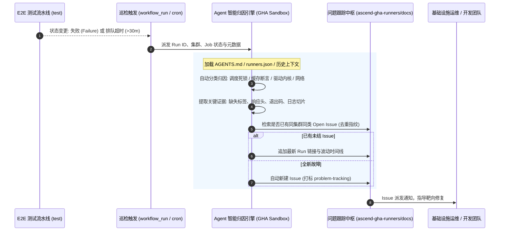

# 0004 — 基于 Agentic Workflow 实现 E2E 测试异常智能巡检与跨仓 Issue 闭环跟踪

- 状态：已接受 (2026-09-29)
- 决策人：CI / 基础设施测试组
- 关联：[`AGENTS.md`](../../AGENTS.md), [`docs/adr/0003-基于agentic-workflow实现issue驱动的e2e用例自闭环开发与验证.md`](0003-基于agentic-workflow实现issue驱动的e2e用例自闭环开发与验证.md), [`ascend-gha-runners/docs`](https://github.com/ascend-gha-runners/docs)

## 背景

当前 [ascend-gha-runners/test](https://github.com/ascend-gha-runners/test) 承载着昇腾 13 个集群基础设施的全链路端到端 (E2E) 验证，包括每日定时跨集群巡检（`e2e-cluster-runners.yml`）、平台特性代理缓存（`e2e-feature-*.yml`）以及 PyTorch 缓存与 PEP 658 元数据完整性扫描（`e2e-scan-pytorch-metadata.yml`）。

在实际运行中，暴露出以下运维阻断与质量监控痛点：
1. **Runner 缺失导致任务静默排队死锁**：
   当某集群 ARC 控制器版本不匹配（如仍为 0.13.0）、缺少 Listener 镜像或标签配置错误时，流水线请求的双标签（如 `runs-on: ["linux-amd64-cpu-2", "gy-003"]`）无法被任何在线 Runner 接单。该任务在 GitHub Actions 中会静默处于 `queued` 状态长达 24 小时才被平台强制取消（典型案例见 [run 36359444984](https://github.com/ascend-gha-runners/test/actions/runs/36359444984)），期间无任何主动告警；
2. **故障离散化，未接入组织级问题跟踪流**：
   测试失败或排队超时散落在各个 Workflow Run 中，而团队统筹管理节点物理故障、驱动异常与 CI 问题的中心集线器位于 [ascend-gha-runners/docs](https://github.com/ascend-gha-runners/docs)（使用 `problem-tracking` 标签）。目前测试仓库与 `docs` 仓库之间缺少自动化纽带，全靠人工偶然排查；
3. **传统告警机器人噪音大且无分析能力**：
   简单的 Webhook 机器人仅能机械转发“Job Failed”，无法区分“环境依赖瞬时抖动”、“Runner 未上线”、“Nginx 缓存代理中断”或“宿主机驱动残留”，导致告警风暴与报警疲劳。

此前 [ADR-0003](0003-基于agentic-workflow实现issue驱动的e2e用例自闭环开发与验证.md) 建立了“从 Issue -> Agent 自动开发用例 -> 真实跑测自愈 -> 提 PR”的**正向交付闭环**；本决策旨在建立**反向守护闭环（Observability & Auto-Triage Loop）**，使系统具备对测试结果自主巡检、智能归因与跨仓工单协同的能力。

---

## 决策架构：目标形态 (Target Architecture)

决定在本仓库引入 **基于 Agentic Workflow 的 E2E 异常智能巡检与跨仓工单闭环机制**。



---

## 核心机制与规范

### 1. 阶段一：双模探测与死锁巡查 (Dual-Trigger & Deadlock Watcher)

巡检触发由两种模式互补构成，杜绝盲区：
- **事件监听模式 (`workflow_run: completed`)**：
  监听核心工作流的结束事件。当 `conclusion == 'failure'` 时实时触发分析，毫秒级捕获断言失败与执行崩溃；
- **心跳巡查模式 (Heartbeat Cron, 建议每 1 小时)**：
  调用 GitHub API 遍历当前处于 `status in ("queued", "in_progress")` 的运行实例；
  - **死锁判定阈值**：单个 Job 排队等待时间超过 **30 分钟**，即判定为“Runner 资源不可达/调度死锁”；
  - 自动打断盲目等待 24 小时的行为，提前介入归因并告警。

### 2. 阶段二：Agent 智能归因与证据链提取 (Autonomous Reasoning)

Agent 在沙箱容器内运行，加载仓库内规则与元数据，执行层次化推断：

| 故障类别 | 判定特征 | 证据链提取内容 | 诊断方向建议 |
|---|---|---|---|
| **调度死锁 / Runner 离线** | Job 处于 `queued` 超过阈值，未分配 runner | 提取请求的 `runs-on` 标签，比对 `runners.json` 与目标集群 | 检查 ARC 控制器版本（需 >= 0.14.0 支持多标签）、Listener 镜像是否为空、Secret 是否下发 |
| **平台特性断言失效** | Step 退出码非 0，三级断言失败 | 提取 `X-Cache-Tier`、缓存命中头、HTTP 状态码及 curl 输出 | 检查 Nginx 缓存 Pod 存活、回源路由与上游源网络连通性 |
| **硬件与宿主机驱动残留** | 出现特定 HCCL / NPU 错误码 | 捕获 `error code 4/19`、`HCCL_E_NPU_WORK`、CANN 初始化日志 | 标记具体宿主机 IP，建议 Cordon 节点并清理内核残留态或重启 |
| **测试环境与通用陷阱** | 命中 `AGENTS.md` Gotchas 列表 | 容器内无 `hostname`、SFS 目录并发踩踏、Git 代理超时等 | 对照避坑基线，提示更新工作流防护措施 |

### 3. 阶段三：跨仓 Issue 去重与生命周期流转 (Deduplication & State Tracking)

为防止告警风暴，严禁无状态地重复创建 Issue。统一在 [ascend-gha-runners/docs](https://github.com/ascend-gha-runners/docs) 遵循以下流转状态机：

1. **唯一故障指纹 (Issue Fingerprint)**：
   按 `[集群名] + [能力/组件] + [错误类型]` 生成唯一标识（例如 `[gy-003][cpu-runner][schedule-deadlock]`）；
2. **检索防重**：
   在创建前，通过 `gh issue list --repo ascend-gha-runners/docs --search "<指纹> is:open"` 检索；
   - **命中已有 Open Issue**：不新建 Issue，调用 `gh issue comment` 在原 Issue 下追加简要追踪记录（更新发生频次与最新 Run URL）；
   - **未命中**：调用 `gh issue create` 创建新工单，打标 `problem-tracking`；
3. **自愈感知 (Self-Healing Acknowledgment)**：
   当连续 N 次巡检验证相关集群或用例恢复全绿后，Agent 自动在原 Issue 下评论“✅ 经 Run xxx 验证，该问题在目标集群已恢复通过”，便于人工复核关闭。

### 4. 阶段四：标准化工单模版 (Standardized Issue Format)

生成的 Issue 必须严格遵循 `ascend-gha-runners/docs` 现有工单规范，包含四大核心要素：

```markdown
[缺陷]: [集群/特性名] E2E 测试异常 — <简要根因>

## 现象
- 关联 Run：https://github.com/ascend-gha-runners/test/actions/runs/<ID>
- 异常任务：<Job 名称>
- 发生时间：<UTC / CST 时间>
- 持续状态：排队超时 (>30m) / 执行断言失败 (exit code: 1)

## 诊断与根因分析
- 涉及集群：<cluster>
- 涉及标签/端点：<labels / endpoint>
- 智能体定位结论：<由 Agent 结合配置与日志给出的结构化诊断>

## 证据链切片
\`\`\`text
<裁剪后的核心错误日志或 HTTP 响应头断言>
\`\`\`

## 建议处置措施
1. <针对性操作建议 1，如升级 ARC 控制器版本>
2. <针对性操作建议 2，如核查 PVC 挂载配置>
```

---

## 理由与系统收益

1. **破除静默失败**：将“排队 24 小时无人知晓”缩短至 30 分钟内主动报出，极大缩短集群故障感知 MTTR；
2. **高质量智能降噪**：依靠 Agentic 推断完成初步日志脱敏、关键证据裁剪与归因，告别原始日志垃圾；
3. **组织级运维统一大盘**：所有测试暴露出的集群基础设施隐患自动收敛至 `docs` 仓库，与业务反馈缺陷同台治理；
4. **形成正反双向飞轮**：
   - **正向 (ADR-0003)**：上游需求 -> Agent 自动写 E2E 用例 -> 跑真实集群自愈 -> 提 PR 合入；
   - **反向 (ADR-0004)**：常态巡检跑测 -> Agent 智能捕获异常 -> 自动归因并提 Issue -> 驱动基础设施修复。

---

## 实施路线图 (Rollout Roadmap)

- **Phase 1（本次）**：确立 ADR 决策、架构边界、指纹机制与工单标准；
- **Phase 2（本地诊断核心）**：在 `scripts/` 下编写独立的诊断器 `scripts/e2e_watcher_analyzer.py`，支持给定 Run ID 自动拉取日志并输出符合模板的 Markdown 报告与指纹；
- **Phase 3（工作流接入）**：配置 `.github/workflows/agentic-e2e-watcher.yml`，注入具备跨仓权限的 GitHub Token/App，打通心跳扫描与自动提 Issue。
