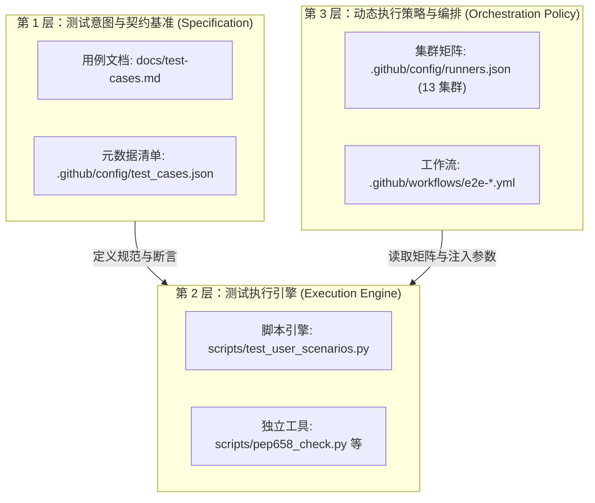

# E2E 测试用例规约与测试意图基准 (Test Case Specifications)

本文档是 `ascend-gha-runners/test` 的**测试意图与验收标准唯一事实来源（Single Source of Truth）**。
通过**将测试意图（What & Why）与动态执行策略（How & When）彻底解耦**，确保基础设施测试的契约基准长期稳定，不受工作流编排语法、集群上下线或调度方式演进的影响。

---

## 一、三层测试解耦架构



1. **第 1 层：规约层（本文件）**：固化测试目的、文档映射、标准调用方式、三级断言标准。版本化沉淀，原则上只随平台特性演进而增补；
2. **第 2 层：引擎层（`scripts/`）**：纯代码实现，可在本地开发环境、本地 Docker 容器或任何 CI 节点独立执行，无需 GHA 上下文依赖；
3. **第 3 层：编排层（`.github/workflows/`）**：负责动态调度，根据 `.github/config/runners.json` 动态派生跨集群矩阵、并发控制、超时及告警。

---

## 二、用例全景索引矩阵

| 用例 ID | 特性 / 场景名称 | 官方文档小节 | 代理端口 / 协议 | 适用客户端 | 关联工作流 | 默认镜像 |
|---|---|---|---|---|---|---|
| [`TC-FEAT-PYPI`](#tc-feat-pypi) | PyPI & PyTorch Wheels 缓存 | [PyPI Cache (Port 80)](https://ascend-gha-runners.github.io/docs/feature/#pypi-cache-port-80) | 80 (HTTP) | `pip`, `uv` | `e2e-feature-pypi-cache.yml` | openEuler CANN 8.2 |
| [`TC-FEAT-APT`](#tc-feat-apt) | Ubuntu APT 镜像缓存 | [APT Cache (Port 8081)](https://ascend-gha-runners.github.io/docs/feature/#apt-cache-port-8081) | 8081 (HTTP) | `apt-get` | `e2e-feature-apt-cache.yml` | Ubuntu 22.04 CANN 9.0 |
| [`TC-FEAT-RUSTUP`](#tc-feat-rustup) | Rust / rustup 工具链缓存 | [Rust Cache (Port 8082)](https://ascend-gha-runners.github.io/docs/feature/#rust-rustup-cache-port-8082) | 8082 (HTTP) | `rustup`, `curl` | `e2e-feature-rustup-cache.yml` | openEuler CANN 8.2 |
| [`TC-FEAT-YUM`](#tc-feat-yum) | openEuler YUM / DNF 缓存 | [YUM Cache (Port 8083)](https://ascend-gha-runners.github.io/docs/feature/#yum-dnf-cache-port-8083) | 8083 (HTTP) | `dnf`, `yum` | `e2e-feature-yum-cache.yml` | openEuler CANN 8.2 |
| [`TC-FEAT-CRATES`](#tc-feat-crates) | crates.io Sparse Index 缓存 | [crates.io Cache (Port 8085)](https://ascend-gha-runners.github.io/docs/feature/#cratesio-cache-port-8085) | 8085 (HTTP) | `cargo` | `e2e-feature-crates-cache.yml` | openEuler CANN 8.2 |
| [`TC-SCHED-DUAL-LABEL`](#tc-sched-dual-label) | 全 13 集群双标签调度与算力自检 | [Runner Pod 接入指导](https://ascend-gha-runners.github.io/docs/user-manual-gha-zh/#runner-pod) | N/A | ARC Listener | `e2e-cluster-runners.yml` | Host Environment |
| [`TC-PEP658-METADATA`](#tc-pep658-metadata) | PyTorch PEP 658 元数据完整性 | [PEP 658 Support](https://ascend-gha-runners.github.io/docs/feature/#pypi-cache-port-80) | 80 (HTTP) | `python`, `pip` | `e2e-cross-cluster-pep658.yml` | openEuler CANN 8.2 |
| [`TC-E2E-USER-SCENARIOS`](#tc-e2e-user-scenarios) | vLLM 生产多工具链端到端全链路 | [Platform Features 综合](https://ascend-gha-runners.github.io/docs/feature/) | 80, 8081, 8082, 8083, 8085 | 复合工具链 | `e2e-user-scenarios.yml` | openEuler CANN 8.2 |

---

## 三、断言分级与判定原则

所有用例的步骤与结果必须严格归属为以下三级：

1. **硬断言 (Hard Assertions，失败即 exit 1 阻断)**：
   - 业务能力与功能契约本身。如：包管理器依赖安装成功、二进制可正常执行、NPU 设备挂载可见、下载路径成功改写回内网。
2. **软断言 (Soft Assertions，带合理容差 / 阈值波动)**：
   - 性能、命中状态与合理波动指标。如：第一次请求 MISS、第二次请求 HIT；CPU/内存限额在 cgroup 取整下达到配额的 90% 以上。异常时打印 WARN 并输出诊断信息。
3. **信息项 (Information Probes，探针类，绝不误报失败)**：
   - 上游环境差异探测。如：特定 Linux 发行版 yum 源仓库格式差异、未同步包通过 RSS 探测候选等。使用 `continue-on-error: true` 或 WARN-skip。

---

## 四、核心用例规格详情

### TC-FEAT-PYPI

#### 1. 基本信息
- **用例 ID**：`TC-FEAT-PYPI`
- **名称**：PyPI 缓存服务（Port 80）与 PyTorch Wheels 缓存（`/whl` 路径）
- **官方文档**：[Platform Features - PyPI Cache (Port 80)](https://ascend-gha-runners.github.io/docs/feature/#pypi-cache-port-80)
- **关联工作流**：`.github/workflows/e2e-feature-pypi-cache.yml`
- **默认执行镜像**：`swr.cn-southwest-2.myhuaweicloud.com/base_image/ascend-ci/cann:8.2.rc1.alpha003-910b-openeuler22.03-py3.11`

#### 2. 测试目的
1. 验证 Pod 经 `cache-service.nginx-pypi-cache.svc.cluster.local:80` 能够正常完成 Python 依赖解析；
2. 验证真实安装过程完全绕过宿主机本地 wheel 缓存（严格禁止 `Using cached`）；
3. 验证 `/whl/cpu` 专属路径下 PyTorch 真实下载安装与运行时导入；
4. 验证镜像源未缓存的包（404）能正确通过 `X-Cache-Tier` 回源至 `pypi.org`。

#### 3. 生产标准使用方式（对标 vllm-project/vllm-ascend）
```bash
# 方式 A：通过 pip config 配置
pip config set global.index-url http://cache-service.nginx-pypi-cache.svc.cluster.local/pypi/simple
pip config set global.trusted-host cache-service.nginx-pypi-cache.svc.cluster.local
pip config set global.no-cache-dir true

# 方式 B：通过环境变量注入 (uv / pip 均适用)
export PIP_INDEX_URL="http://cache-service.nginx-pypi-cache.svc.cluster.local/pypi/simple"
export PIP_TRUSTED_HOST="cache-service.nginx-pypi-cache.svc.cluster.local"
export UV_INDEX_URL="http://cache-service.nginx-pypi-cache.svc.cluster.local/pypi/simple"
export UV_INSECURE_HOST="cache-service.nginx-pypi-cache.svc.cluster.local"
export UV_INDEX_STRATEGY="unsafe-best-match"
export UV_NO_CACHE=1
export UV_SYSTEM_PYTHON=1

# 真实安装业务依赖
pip install --no-cache-dir uv uc-manager

# PyTorch 经 /whl 路径安装
pip install torch --index-url http://cache-service.nginx-pypi-cache.svc.cluster.local/whl/cpu
```

#### 4. 判定标准
- **硬断言**：`pip install --no-cache-dir uv uc-manager` 返回码 0；输出中无 `Using cached`；`python -c "import torch; print(torch.__version__)"` 执行成功；
- **软断言**：请求 `/pypi/simple/six/` 响应包含 `X-Pypi-Cache` 且在二次请求呈现 HIT；
- **探针**：请求虚构包 `e2e-nonexistent-pkg-${GITHUB_RUN_ID}` 探测 `X-Cache-Tier: pypi-org`。

---

### TC-FEAT-APT

#### 1. 基本信息
- **用例 ID**：`TC-FEAT-APT`
- **名称**：Ubuntu / Debian APT 镜像缓存服务（Port 8081）
- **官方文档**：[Platform Features - APT Cache (Port 8081)](https://ascend-gha-runners.github.io/docs/feature/#apt-cache-port-8081)
- **关联工作流**：`.github/workflows/e2e-feature-apt-cache.yml`
- **默认执行镜像**：`swr.cn-southwest-2.myhuaweicloud.com/base_image/ascend-ci/cann:9.0.0-a3-ubuntu22.04-py3.12`

#### 2. 测试目的
1. 验证 Ubuntu 环境下经 `sed` 改写 `/etc/apt/sources.list` 后能够连通 8081 端口；
2. 验证 `apt-get update` 索引刷新无网络阻断；
3. 验证真实安装构建工具包（`git`, `zstd`, `gcc`, `cmake`）并验证二进制可执行。

#### 3. 生产标准使用方式（对标 vllm-project/vllm-ascend CI）
```bash
# 替换官方 ports 与 archive 地址为集群内网 8081 代理
sed -Ei 's@(ports|archive).ubuntu.com@cache-service.nginx-pypi-cache.svc.cluster.local:8081@g' /etc/apt/sources.list
if [ -d /etc/apt/sources.list.d ]; then
  sed -Ei 's@(ports|archive).ubuntu.com@cache-service.nginx-pypi-cache.svc.cluster.local:8081@g' /etc/apt/sources.list.d/*.list 2>/dev/null || true
fi

apt-get update -y
apt-get install -y --no-install-recommends git zstd gcc cmake
```

#### 4. 判定标准
- **硬断言**：`apt-get update -y` 返回码 0；`git --version`, `zstd --version`, `gcc --version` 正常输出版本；
- **软断言**：无网络超时或重试失败；
- **探针**：探测 `http://cache-service...:8081` 端口 HTTP 连通状态。

---

### TC-FEAT-RUSTUP

#### 1. 基本信息
- **用例 ID**：`TC-FEAT-RUSTUP`
- **名称**：Rust / rustup 工具链镜像缓存服务（Port 8082）
- **官方文档**：[Platform Features - Rust / rustup Cache (Port 8082)](https://ascend-gha-runners.github.io/docs/feature/#rust-rustup-cache-port-8082)
- **关联工作流**：`.github/workflows/e2e-feature-rustup-cache.yml`
- **默认执行镜像**：`swr.cn-southwest-2.myhuaweicloud.com/base_image/ascend-ci/cann:8.2.rc1.alpha003-910b-openeuler22.03-py3.11`

#### 2. 测试目的
1. 验证 `RUSTUP_DIST_SERVER` 与 `RUSTUP_UPDATE_ROOT` 经 8082 端口下载稳定生效；
2. 验证经内网镜像下载 `rustup-init.sh` 并完成 `stable minimal` 工具链快速安装；
3. 验证 `rustc` 与 `cargo` 二进制就绪并具备源码即时编译能力。

#### 3. 生产标准使用方式（对标 vllm-project/vllm-ascend Dockerfile）
```bash
export RUSTUP_DIST_SERVER="http://cache-service.nginx-pypi-cache.svc.cluster.local:8082/rustup"
export RUSTUP_UPDATE_ROOT="http://cache-service.nginx-pypi-cache.svc.cluster.local:8082/rustup/rustup"

# 经内网镜像拉取安装器并剥离 https 限制
curl -fsSL "${RUSTUP_UPDATE_ROOT}/rustup-init.sh" -o /tmp/rustup-init.sh
sed -i "s/--proto '=https'//g; s/--https-only//g" /tmp/rustup-init.sh
sh /tmp/rustup-init.sh -y --default-toolchain stable --profile minimal --no-modify-path

export PATH="$HOME/.cargo/bin:$PATH"
rustc --version
cargo --version
```

#### 4. 判定标准
- **硬断言**：安装器退出码 0；`rustc --version` 与 `cargo --version` 成功输出有效语义版本号；
- **软断言**：`echo 'fn main() { println!("ok"); }' | rustc - -o /tmp/t && /tmp/t` 输出成功；
- **探针**：`X-Rustup-Cache` 缓存状态头。

---

### TC-FEAT-YUM

#### 1. 基本信息
- **用例 ID**：`TC-FEAT-YUM`
- **名称**：openEuler YUM / DNF RPM 镜像缓存服务（Port 8083）
- **官方文档**：[Platform Features - YUM / DNF Cache (Port 8083)](https://ascend-gha-runners.github.io/docs/feature/#yum-dnf-cache-port-8083)
- **关联工作流**：`.github/workflows/e2e-feature-yum-cache.yml`
- **默认执行镜像**：`swr.cn-southwest-2.myhuaweicloud.com/base_image/ascend-ci/cann:8.2.rc1.alpha003-910b-openeuler22.03-py3.11`

#### 2. 测试目的
1. 验证 openEuler 容器通过 `sed` 将官方 `repo.openeuler.org` 指向内网 8083 缓存服务；
2. 验证 `dnf makecache` / `yum makecache` 元数据完整拉取；
3. 验证真实安装 `git` 与 `zstd` 构建工具并正常调用。

#### 3. 生产标准使用方式（对标 vllm-project/vllm-ascend CI）
```bash
sed -i 's|https://repo.openeuler.org|http://cache-service.nginx-pypi-cache.svc.cluster.local:8083|g' /etc/yum.repos.d/*.repo || true
sed -Ei 's@https?://[^/]+/(openeuler|centos|fedora)@http://cache-service.nginx-pypi-cache.svc.cluster.local:8083/\1@g' /etc/yum.repos.d/*.repo || true

dnf clean all || yum clean all
dnf makecache || yum makecache
dnf install -y git zstd || yum install -y git zstd
```

#### 4. 判定标准
- **硬断言**：`dnf/yum makecache` 成功返回；`git --version` 与 `zstd --version` 验证正常；
- **软断言**：无不可达 mirror 报警；
- **探针**：8083 端口直接探测连通性。

---

### TC-FEAT-CRATES

#### 1. 基本信息
- **用例 ID**：`TC-FEAT-CRATES`
- **名称**：crates.io Sparse Index 与 Crate 下载缓存服务（Port 8085）
- **官方文档**：[Platform Features - crates.io Cache (Port 8085)](https://ascend-gha-runners.github.io/docs/feature/#cratesio-cache-port-8085)
- **关联工作流**：`.github/workflows/e2e-feature-crates-cache.yml`
- **默认执行镜像**：`swr.cn-southwest-2.myhuaweicloud.com/base_image/ascend-ci/cann:8.2.rc1.alpha003-910b-openeuler22.03-py3.11`

#### 2. 测试目的
1. 验证 `config.json` 一级源由 `rsproxy` 提供，且其内部 `dl` 下载 URL 被透明改写回集群内网 8085 端口；
2. 验证配置 Cargo Sparse Index 后，能够真实创建工程、拉取依赖包并完成 `cargo build`；
3. 验证生成的二进制文件正常运行；
4. 验证 crate 压缩包请求响应头 `X-Crates-Cache` 命中（MISS → HIT）。

#### 3. 生产标准使用方式（对标 vllm-project/vllm-ascend CI）
```bash
export CRATES_IO_INDEX="http://cache-service.nginx-pypi-cache.svc.cluster.local:8085/index/"

mkdir -p $HOME/.cargo
cat > $HOME/.cargo/config.toml <<EOF
[source.crates-io]
replace-with = "huaweicloud"

[source.huaweicloud]
registry = "sparse+http://cache-service.nginx-pypi-cache.svc.cluster.local:8085/index/"
EOF

# 真实工程拉取依赖并编译
cargo new --bin vllm_crates_verify
cd vllm_crates_verify
echo 'anyhow = "1.0.75"' >> Cargo.toml
cargo build
./target/debug/vllm_crates_verify
```

#### 4. 判定标准
- **硬断言**：`config.json` 包含改写后的 `http://cache-service...:8085/api/v1/crates`；`cargo build` 编译成功；目标二进制输出预期字串；
- **软断言**：`config.json` 带有 `X-Cache-Tier: rsproxy`；下载接口存在 `X-Crates-Cache`；
- **探针**：上游 USTC 返回 403 Access Denied 时，官方 crates-official 优雅回退兜底（PR #1722 能力）。

---

### TC-SCHED-DUAL-LABEL

#### 1. 基本信息
- **用例 ID**：`TC-SCHED-DUAL-LABEL`
- **名称**：全 13 集群 Runner `[型号, 区域]` 双标签调度与芯片识别
- **官方文档**：[GitHub Actions 接入昇腾算力指导 - Runner pod 命名规范](https://ascend-gha-runners.github.io/docs/user-manual-gha-zh/#runner-pod)
- **关联工作流**：`.github/workflows/e2e-cluster-runners.yml`
- **集群覆盖**：全部 13 个接入集群（`gy-001`, `wlcb`, `sz-lab`, `gy-003`, `gy-004`, `gy-005`, `gy-006`, `cn12-001`, `sh-001`, `sh-002`, `hk-001`, `aiframework`, `mind-third-ci`）

#### 2. 测试目的
1. 验证上游 PR [ascend-ci-deployment#1753](https://github.com/opensourceways/ascend-ci-deployment/pull/1753) 接入的组织级 Runner 在所有 13 个集群均能被 GitHub Actions 正确分发与调度；
2. 验证 `[型号, 区域]` 双标签调度（如 `["linux-aarch64-a3-2", "cn12-001"]`）精准命中目标集群；
3. 验证基础 CPU/Python 算力与 NPU 芯片设备文件挂载正常。

#### 3. 判定标准
- **硬断言**：Job Pod 调度并在指定集群的 Runner 上执行；NPU 节点存在 `/dev/davinci*` 设备文件；基础 Python 运算验证通过；
- **软断言**：`npu-smi info` 可执行并打印驱动与算力卡信息；
- **探针**：主机名、内核版本、OS 发行版信息。

---

### TC-PEP658-METADATA

#### 1. 基本信息
- **用例 ID**：`TC-PEP658-METADATA`
- **名称**：PyTorch Simple Index PEP 658 Metadata 校验和完整性
- **关联工作流**：`.github/workflows/e2e-cross-cluster-pep658.yml`
- **默认执行镜像**：`swr.cn-southwest-2.myhuaweicloud.com/base_image/ascend-ci/cann:8.2.rc1.alpha003-910b-openeuler22.03-py3.11`

#### 2. 测试目的
针对 `pytorch/pytorch#197552` 缺陷，跨全集群验证内网缓存服务的 PyTorch Simple Index 具备完整的 PEP 658 元数据支持，杜绝破坏行或校验和不匹配导致现代 pip 解析失败。

#### 3. 判定标准
- **硬断言**：元数据 SHA-256 校验和与 HTML 属性完全一致；RFC 822 元数据头部解析正常，无末尾破坏行；
- **软断言**：缓存服务无损回放。

---

### TC-E2E-USER-SCENARIOS

#### 1. 基本信息
- **用例 ID**：`TC-E2E-USER-SCENARIOS`
- **名称**：vLLM 生产多工具链端到端全链路场景
- **关联工作流**：`.github/workflows/e2e-user-scenarios.yml`
- **底层驱动脚本**：[`scripts/test_user_scenarios.py`](file:///home/lcr/gha-test/scripts/test_user_scenarios.py)

#### 2. 测试目的
串联 OS 包管理器、Python+uv 构建安装、Rust 工具链与 Crates 编译、Git 镜像代理全部链路，模拟生产作业流水线在真实集群节点的端到端执行。

#### 3. 判定标准
- **硬断言**：各组件全流程执行成功，返回码 0；
- **软断言**：Crate 403 容灾降级；
- **探针**：网络延迟与出口 IP 诊断。

---

## 五、用例执行与复现操作指南

### 1. GitHub Actions 触发 (远程矩阵执行)
```bash
# 执行全部 5 大 Platform Features
gh workflow run e2e-feature-pypi-cache.yml   --repo ascend-gha-runners/test
gh workflow run e2e-feature-apt-cache.yml    --repo ascend-gha-runners/test
gh workflow run e2e-feature-rustup-cache.yml --repo ascend-gha-runners/test
gh workflow run e2e-feature-yum-cache.yml    --repo ascend-gha-runners/test
gh workflow run e2e-feature-crates-cache.yml --repo ascend-gha-runners/test

# 触发指定集群与 Runner 类型
gh workflow run e2e-feature-pypi-cache.yml -f cluster=cn12-001 -f runner_type=npu --repo ascend-gha-runners/test

# 触发全 13 集群联通性验证
gh workflow run e2e-cluster-runners.yml --repo ascend-gha-runners/test
```

### 2. 容器与本地调试复现 (脱离 GHA 上下文)
```bash
# 在集群内任意 Pod 或本地连通内网的环境中执行引擎脚本
python3 scripts/test_user_scenarios.py --cache-host "cache-service.nginx-pypi-cache.svc.cluster.local" --scenarios "pypi"
python3 scripts/test_user_scenarios.py --cache-host "cache-service.nginx-pypi-cache.svc.cluster.local" --scenarios "apt"
python3 scripts/test_user_scenarios.py --cache-host "cache-service.nginx-pypi-cache.svc.cluster.local" --scenarios "yum"
python3 scripts/test_user_scenarios.py --cache-host "cache-service.nginx-pypi-cache.svc.cluster.local" --scenarios "rustup"
python3 scripts/test_user_scenarios.py --cache-host "cache-service.nginx-pypi-cache.svc.cluster.local" --scenarios "crates"

# 全量组合场景执行
python3 scripts/test_user_scenarios.py --scenarios "all"
```
